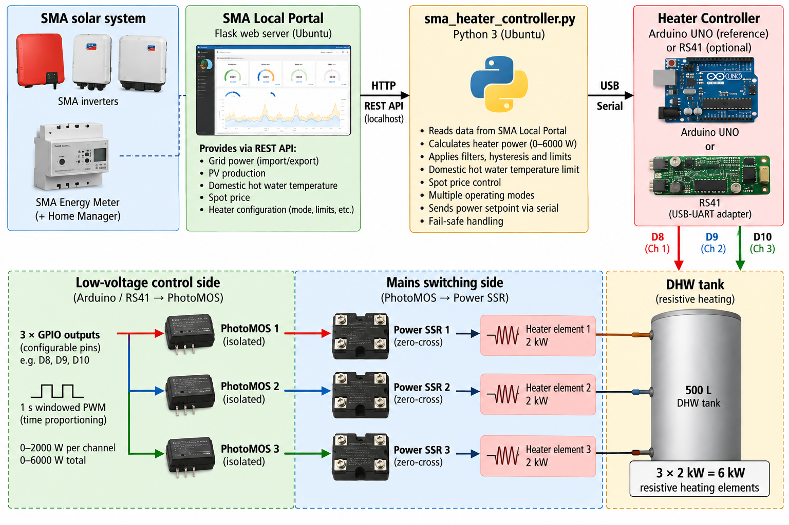

# SMA Heater Controller

A local heater controller for using surplus solar energy for resistive
domestic hot water heating.

The controller runs on a Linux host and uses data from
[SMA Local Portal](https://github.com/tahtisade/sma-local-portal) to control
up to 6 kW of resistive heating through a small serial-connected hardware
controller.

The current reference hardware is an Arduino UNO. A repurposed
Vaisala RS41 radiosonde is also supported as an optional experimental
development platform.

Current release: **v2.5.0**

## Architecture



The system is divided into two parts:

- `sma_heater_controller.py` runs the control logic on the Linux host.
- A serial-connected hardware controller generates the time-proportioned
  outputs for the heater channels.

In the Arduino UNO reference implementation, pins D8, D9 and D10 control
three low-voltage PhotoMOS stages. These in turn control suitable power SSRs
for three 2 kW resistive heater elements.

The mains-voltage power stage is intentionally outside the scope of this
software project.

## Features

- Up to 6000 W total heater power
- Three 2000 W heater channels in the Arduino reference firmware
- 1 second time-proportioned output window
- SMA grid power based surplus control
- Grid export target and deadband control
- EMA filtering
- Faster ramp-down than ramp-up
- Domestic hot water temperature safety limit
- Spot-price based operation
- Configurable maximum heater power
- Configurable PRICE-mode operating time window
- Arduino UNO USB auto-detection
- Optional repurposed Vaisala RS41 radiosonde controller support
- RS41 USB-UART adapter selection by serial number
- Serial heartbeat/status handling
- Safe startup and shutdown at 0 W
- Fail-safe 0 W output after repeated data or sensor failures

## Operating modes

The operating mode is received from SMA Local Portal.

### OFF

Heating is disabled.

### ON

Heating is enabled independently of PV surplus, subject to the configured
power and safety limits.

### PV

Heater power follows available PV surplus.

### PV + PRICE

PV surplus heating is allowed only when the spot-price condition permits it.

### PRICE

Heating does not depend on PV surplus.

Full configured heater power is requested only when:

1. the current local time is inside the configured PRICE operating window,
2. the spot price is available, and
3. the spot price is at or below the configured price limit.

Otherwise the requested heater power is 0 W.

The operating window supports normal and midnight-crossing intervals.

Examples:

- `00:00 -> 06:00` = midnight to 06:00
- `22:00 -> 06:00` = 22:00 through midnight to 06:00
- identical start and end times = enabled for the full day

Invalid time values fail safely with heating disabled in PRICE mode.

## Arduino UNO reference controller

The included Arduino firmware is:

```text
heater_controller.ino
```

Default output pins:

| Channel | Arduino pin | Nominal heater power |
|---|---:|---:|
| 1 | D8 | 2000 W |
| 2 | D9 | 2000 W |
| 3 | D10 | 2000 W |

The firmware uses a 1 second time window to distribute the requested total
power between the three heater channels.

The host automatically detects a standard Arduino UNO using its USB VID/PID.

## Vaisala RS41 radiosonde support

A repurposed Vaisala RS41 radiosonde can be used as an alternative
heater-controller platform.

The RS41 is originally a meteorological radiosonde platform. In this project,
its embedded hardware can be repurposed to receive heater power commands from
the Linux host and control the low-voltage heater-control interface.

The RS41 communicates with the Linux host through a USB-UART adapter.

This is an experimental/development platform; the Arduino UNO remains the
reference implementation.

The USB-UART adapter is selected using the environment variable:

```text
HEATER_RS41_SERIAL
```

Example:

```text
HEATER_RS41_SERIAL=YOUR_FTDI_SERIAL_NUMBER
```

An example environment file is provided in:

```text
examples/sma-heater-controller.env.example
```

The RS41 firmware itself is not included in this repository.

## Serial protocol

The host and heater controller communicate at 9600 baud.

Typical commands:

```text
SET_POWER <watts>
GET_STATUS
```

Typical replies:

```text
HEATER_CONTROLLER_READY
OK POWER=<watts>
STATUS POWER=<watts>
```

The controller may also send heartbeat/status messages while operating.

## Requirements

- Linux host
- Python 3
- SMA Local Portal
- `requests`
- `pyserial`
- Arduino UNO with the included firmware, or a compatible serial heater controller

Install the Python dependencies with:

```bash
python3 -m pip install -r requirements.txt
```

A Python virtual environment may also be used.

## SMA Local Portal integration

By default the controller expects SMA Local Portal on the same host:

```text
http://localhost:8080
```

The controller reads the SMA status API and heater configuration API.

SMA Local Portal is a separate project:

https://github.com/tahtisade/sma-local-portal

## systemd

An example systemd service is provided:

```text
examples/sma-heater-controller.service
```

Copy and adapt it for the local installation.

For RS41 operation, the local environment file can contain:

```text
HEATER_RS41_SERIAL=YOUR_FTDI_SERIAL_NUMBER
```

The real environment file should remain local and must not be committed to
the repository.

## Fail-safe behaviour

The controller is designed to fail toward 0 W heater output.

Examples include:

- safe startup at 0 W
- safe shutdown at 0 W
- repeated SMA API failures
- unavailable required sensor data
- serial communication problems
- invalid PRICE-mode time configuration

These software protections do not replace independent electrical or thermal
safety devices.

## Electrical safety

This project controls only the low-voltage control side of the heating
system.

The Arduino GPIO outputs are intended to drive suitable isolated low-voltage
interfaces such as PhotoMOS devices, which can then control appropriately
rated power SSRs.

Mains-voltage wiring, over-current protection, contactors, SSR sizing,
thermal protection and heater installation are outside the scope of this
repository.

All mains-voltage work must use appropriate components, protection and
electrical safety practices.

## License

This project is licensed under the MIT License.

See [LICENSE](LICENSE).
